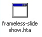
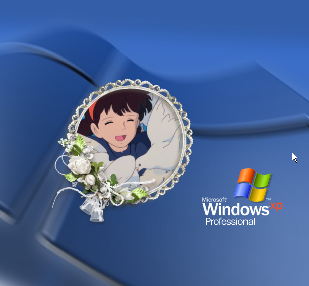

#  Frameless Slideshow

## About

A free open-source slide show application for **Windows** to display images in the corner of your desktop with various fun features like borderless window, filter effects, overlaying images, etc.

### Features

- Slide show with transition effects
- Image filter effects
- Shapes
- Picture frame
- No window border
- Transparent background (pseudo)
- Overlaying images
- Flexible positioning

### System requirements

Windows **XP** or later.

## Download and install

1. Download the zip file from [here]({{zip}}).
1. Extract it into a folder.
1. Open the folder and run `frameless-slideshow.hta`

## How to use
### Basic usage

#### 1. Create a frame
Click "Create Frame" on the starting menu. A new slideshow frame will be created.

#### 2. Add image files

Then click "Open Image File" or "Open Image Folder", and choose your image file or folder. Or just drag and drop an image or a folder to the window (it can only accept one dropped file at a time).

#### 3. Play the slideshow

The slideshow will automatically start if you added multiple images. It can be controlled with overlay buttons that appear when you hover over it.

#### 4. Customize the slideshow

You can move and resize the frame. If you want to add another frame, right click on the window to open its context menu, then select "New Frame" -> "Add New Frame". A variety of settings are also available on the menu.

#### 5. Save and exit

When you click "Exit" on the context menu, it will ask if you want to save the current slideshow. You can load the save file from the starting menu next time. The extension of the save file for this application is ".flss".

### Advanced usage

#### How to Attach Picture Frame

Although this application is named "Frameless", its one of the fun features is the Picture Frame.

**For simple rectangular picture frames**

First of all, you need a picture frame image in GIF or PNG format with transparency.

1: Create a slideshow to which you want to apply a picture frame. If it is playing, stop it.

2: Right click on the frame and select "View" -> "Image: fill up frame" on the context menu.

3: Create another frame for the picture frame itself.

4: Then resize the picture frame and the slideshow image so that the image fits within the picture frame.

5: Right click the **picture frame**, and select "Frame Settings" -> "Attach this as picture frame" on the context menu.

6: Done. The picture frame stuck to the slideshow. When you want to remove the picture frame, select "Frame Settings" -> "Remove picture frame".

**For various shaped picture frames**

If you want to use a picture frame that is not rectangular, you need a shape data of the same shape as the frame. "Shape data" in this application mean a GIF or a PNG image with a transparent color. Its opacity part is used as the shape. A "circle" shape is available on this app by default, so we will use a round picture frame as an example in this section.

1: Follow Step 1 - 3 above.

2: Right click on the slideshow, then select "Image settings" -> "Shapes" -> "Circle".

3: Then follow Step 4, 5 above.

4: Enjoy!

#### Other Details

Currently under construction.

## Notes

This application is still in mid-development. Please send me bug reports or any suggestions.

### Known Problems
#### VML Memory leak

This application is powered by very old Internet Explorer technology including [VML](https://learn.microsoft.com/en-us/windows/win32/vml/web-workshop---specs---standards----introduction-to-vector-markup-language--vml-). It uses VML to shrink high-resolution images beautifully without jaggies, but those VML images cause memory leaks each time a new image is loaded. I couldn't find how to resolve the problem (if you know, please tell me), so the application finally just prompt you to restart itself when the amount of leaked memory reaches a certain limit (about 600MB). If you want to avoid this, set the image quality of the slideshows to "medium" or "low" that always use normal IMG element.

#### VML stops animated GIFs

VML also has a problem with animated GIF. It can play the animation of the first GIF file, but then freezes when loaded the second one. Don't set the image quality to "high"(VML) if you want to enjoy animated GIFs.

#### Multi-monitor environment
Currently this application only works properly on the primary monitor. In relation to this, when the Wallpaper Fit setting is "Span", the wallpaper synchronization may be broken.

## Credits

### Repository
[GitHub](https://github.com/gitcobra/frameless-slideshow)

### Resources

* <a href="https://www.flaticon.com/free-icons/slideshow" title="slideshow icons">Slideshow icons created by Freepik - Flaticon</a>
